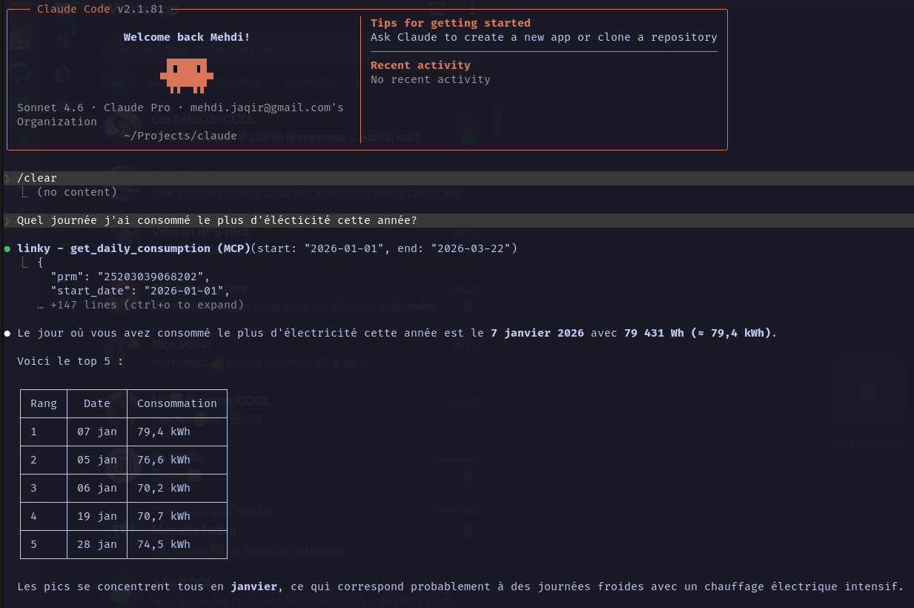
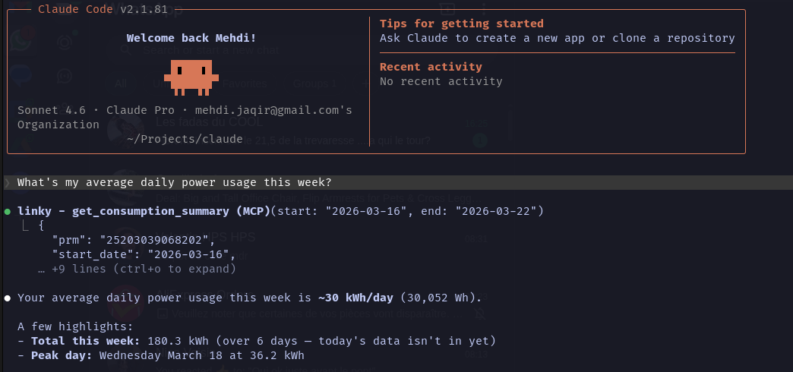
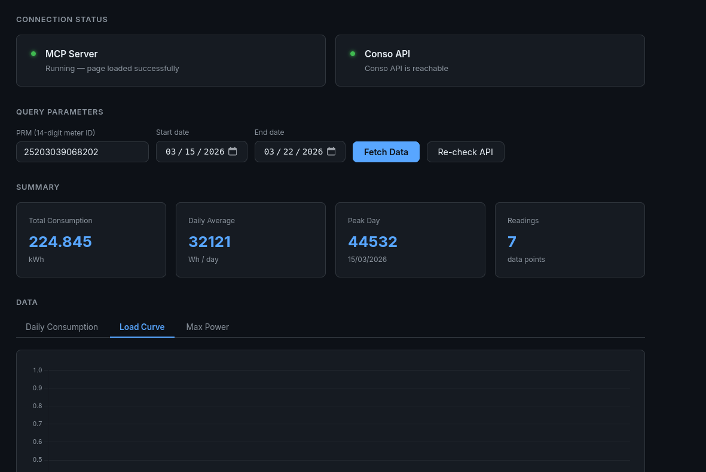
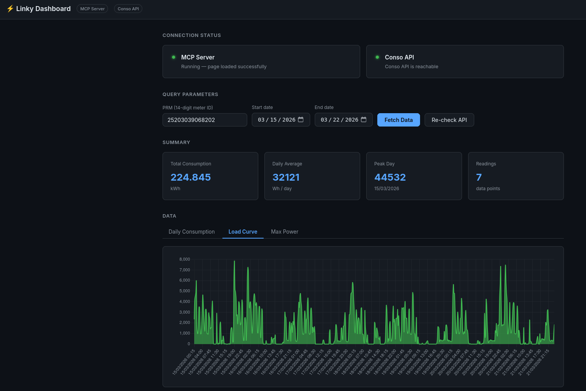

# Enedis Linky MCP Server ⚡

<p align="center">
  <a href="https://github.com/mjrgr/enedis-linky-mcp-server/actions/workflows/ci.yml">
    
  </a>
  <a href="https://img.shields.io/github/go-mod/go-version/mjrgr/enedis-linky-mcp-server">
    
  </a>
  <a href="https://github.com/mjrgr/enedis-linky-mcp-server/releases">
    
  </a>
  <a href="https://hub.docker.com/r/mehdijrgr/enedis-linky-mcp-server">
    
  </a>
  <a href="https://hub.docker.com/r/mehdijrgr/enedis-linky-mcp-server">
    
  </a>
  
  <a href="LICENSE">
    
  </a>
</p>

A production-ready [Model Context Protocol](https://modelcontextprotocol.io/) (MCP) server written in Go
that wraps the [Conso API](https://conso.boris.sh), giving AI assistants like Claude direct
access to your **Enedis Linky** smart meter data.

---

## Table of Contents

- [Enedis Linky MCP Server ⚡](#enedis-linky-mcp-server-)
  - [Table of Contents](#table-of-contents)
  - [Features](#features)
  - [Prerequisites](#prerequisites)
  - [Quick Start](#quick-start)
    - [1. Build the binary](#1-build-the-binary)
    - [2. Set your credentials](#2-set-your-credentials)
    - [3. Run (stdio mode)](#3-run-stdio-mode)
    - [Run in SSE mode](#run-in-sse-mode)
  - [Using with Claude Desktop](#using-with-claude-desktop)
  - [Using with Claude CLI](#using-with-claude-cli)
    - [stdio transport](#stdio-transport)
    - [SSE transport](#sse-transport)
      - [1. Prepare your env file](#1-prepare-your-env-file)
      - [2. Start the server](#2-start-the-server)
      - [3. Register with Claude CLI](#3-register-with-claude-cli)
    - [Example usage](#example-usage)
  - [Docker](#docker)
    - [Build locally with Podman](#build-locally-with-podman)
  - [Dashboard](#dashboard)
    - [With Docker](#with-docker)
  - [Configuration](#configuration)
  - [Security](#security)
  - [MCP Tools Reference](#mcp-tools-reference)
  - [Project Structure](#project-structure)
  - [Development](#development)
  - [Troubleshooting](#troubleshooting)
  - [Community \& Support](#community--support)
  - [Contributing](#contributing)
  - [License](#license)
  - [Acknowledgements](#acknowledgements)

---

## Features

- **5 MCP tools** covering Linky consumption, load curve, max power, and solar production data
- **Bearer token authentication** via the free [Conso API](https://conso.boris.sh) proxy
- **Automatic retry** with exponential backoff on transient errors
- **Rate-limit awareness** — respects the 5 req/s and 10k req/h limits
- **Dual MCP transports** — `stdio` for Claude Desktop, `sse` for HTTP clients
- **Structured logging** — JSON logs via `log/slog` with configurable levels
- **CI/CD** — GitHub Actions for testing, linting, and cross-platform releases

---

## Prerequisites

<ul>
  <li>🦫 <b>Go</b> (latest version recommended)</li>
  <li>🔑 <b>Conso API token</b> — register for free at <a href="https://conso.boris.sh">conso.boris.sh</a></li>
  <li>🆔 <b>PRM number</b> — your 14-digit Linky meter identifier (found on your electricity bill)</li>
</ul>

<details>
<summary><b>How to enable data collection on your Enedis account</b></summary>

Log in to your [Enedis customer space](https://mon-compte-client.enedis.fr) and enable:

- *Enregistrement de la consommation horaire*
- *Collecte de la consommation horaire*

Then register at [conso.boris.sh](https://conso.boris.sh) to get your free API token and authorize your PRM.

</details>

---

## Quick Start

### 1. Build the binary

```bash
git clone https://github.com/mjrgr/enedis-linky-mcp-server.git
cd enedis-linky-mcp-server

go mod download
make build
# Binary is at ./bin/enedis-linky-mcp-server
```

### 2. Set your credentials

```bash
export CONSO_API_TOKEN="your_token_here"
export LINKY_PRM="12345678901234"   # optional but recommended
```

### 3. Run (stdio mode)

```bash
./bin/enedis-linky-mcp-server
```

### Run in SSE mode

```bash
export MCP_TRANSPORT=sse
export PORT=8080
./bin/enedis-linky-mcp-server
# Listening on :8080 — point your MCP client at http://localhost:8080/sse
```

---

## Using with Claude Desktop

Edit your Claude Desktop config file:

- **macOS:** `~/Library/Application Support/Claude/claude_desktop_config.json`
- **Windows:** `%APPDATA%\Claude\claude_desktop_config.json`

```json
{
  "mcpServers": {
    "linky": {
      "command": "/absolute/path/to/bin/enedis-linky-mcp-server",
      "env": {
        "CONSO_API_TOKEN": "your_token_here",
        "LINKY_PRM": "12345678901234"
      }
    }
  }
}
```

Restart Claude Desktop — the Linky tools will appear in the tool list.

You can then ask things like:

- "Show me my electricity consumption for the past week"
- "What was my peak power usage this month?"
- "Compare my daily consumption over the last 30 days"
- "How much solar energy did I produce today?"

---

## Using with Claude CLI

The server supports two transports: **stdio** (default) and **SSE** (HTTP). SSE is the recommended
approach when running via Docker or Podman as it avoids the stdio-in-container overhead.

### stdio transport

<details>
<summary><b>Docker</b></summary>

```bash
claude mcp add linky -s local -- docker run -i --rm \
  -e CONSO_API_TOKEN=your_token_here \
  -e LINKY_PRM=12345678901234 \
  ghcr.io/mjrgr/enedis-linky-mcp-server:latest
```

</details>

<details>
<summary><b>Local binary</b></summary>

```bash
claude mcp add linky -s local -- /absolute/path/to/bin/enedis-linky-mcp-server
```

Set `CONSO_API_TOKEN` and optionally `LINKY_PRM` in your shell environment before running.

</details>

### SSE transport

SSE runs the server as a persistent HTTP process. Start it once, then point Claude CLI at its URL.

#### 1. Prepare your env file

```bash
cp .env.example .env.local
# Edit .env.local — set CONSO_API_TOKEN, LINKY_PRM, and MCP_TRANSPORT=sse
```

```ini
CONSO_API_TOKEN=your_token_here
LINKY_PRM=12345678901234
MCP_TRANSPORT=sse
PORT=8080
```

#### 2. Start the server

<details>
<summary><b>Docker</b></summary>

```bash
docker run --rm \
  --env-file .env.local \
  -p 8080:8080 \
  ghcr.io/mjrgr/enedis-linky-mcp-server:latest
```

</details>

<details>
<summary><b>Podman</b></summary>

```bash
podman build -t enedis-linky-mcp -f Containerfile .
podman run --rm \
  --env-file .env.local \
  -p 8080:8080 \
  enedis-linky-mcp
```

</details>

#### 3. Register with Claude CLI

```bash
claude mcp add linky --transport sse http://localhost:8080/sse
```

---

### Example usage

```bash
claude "Show me my electricity consumption for today"
```

```bash
claude "What's my average daily power usage this week?"
```




---

## Docker

```bash
docker run --rm \
  --env-file .env.local \
  -p 8080:8080 \
  ghcr.io/mjrgr/enedis-linky-mcp-server:latest
```

### Build locally with Podman

```bash
podman build -t enedis-linky-mcp -f Containerfile .
podman run --rm \
  --env-file .env.local \
  -p 8080:8080 \
  enedis-linky-mcp
```

---

## Dashboard

Enable the built-in web dashboard to test your API connection and visualize meter data
directly in the browser — no Claude client required.

```bash
export CONSO_API_TOKEN=your_token_here
export LINKY_DASHBOARD=true
export LINKY_PRM=12345678901234   # optional — pre-fills the PRM field in the dashboard
./bin/enedis-linky-mcp-server
# Dashboard available at http://localhost:8081
```

The dashboard provides:

- **Connection status** — MCP server health + live Conso API reachability check
- **Summary stats** — total kWh, daily average, peak day, reading count
- **Daily Consumption** chart (bar)
- **Load Curve** chart (30-minute intervals, line)
- **Max Power** chart (bar)




### With Docker

```bash
docker run --rm \
  -e CONSO_API_TOKEN=your_token_here \
  -e LINKY_PRM=12345678901234 \
  -e LINKY_DASHBOARD=true \
  -e MCP_TRANSPORT=sse \
  -p 8080:8080 \
  -p 8081:8081 \
  ghcr.io/mjrgr/enedis-linky-mcp-server:latest
```

The dashboard runs on a **separate port** from the MCP SSE transport so both can coexist.

---

## Configuration


| Variable | Required | Default | Description |
| ----------------------- | ---------- | ------------------------------ | ------------- |
| `CONSO_API_TOKEN` | Yes | — | Conso API bearer token (get yours at [conso.boris.sh](https://conso.boris.sh)) |
| `LINKY_PRM` | No | — | Default PRM (14-digit meter identifier). When set, the `prm` parameter becomes optional in all MCP tool calls and is pre-filled in the dashboard. |
| `MCP_TRANSPORT` | No | `stdio` | `stdio` (Claude Desktop) or `sse` (HTTP server) |
| `PORT` | No | `8080` | HTTP port for SSE transport |
| `LOG_LEVEL` | No | `info` | Log level: `debug`, `info`, `warn`, `error` |
| `CONSO_API_BASE_URL` | No | `https://conso.boris.sh/api` | API base URL override (for testing) |
| `LINKY_DASHBOARD` | No | `false` | Set to `true` to enable the web dashboard |
| `LINKY_DASH_ADDR` | No | `:8081` | Listen address for the dashboard (e.g. `:8081`) |

> Copy `.env.example` to `.env.local` and fill in your values for local development.

---

## Security

> 🔒 **Security Best Practices**

- **Never commit real API tokens** to version control. Use environment variables or `.env.local` for local development.
- **Rotate your token** if you suspect it is compromised — regenerate it at [conso.boris.sh](https://conso.boris.sh).
- **Report vulnerabilities** by opening a security issue or emailing the maintainers.

---

## MCP Tools Reference

| Tool | Description |
| --- | --- |
| `get_daily_consumption` | Daily electricity consumption (Wh) for a date range |
| `get_load_curve` | 30-minute average power readings (W) |
| `get_max_power` | Maximum power reached each day (VA) |
| `get_daily_production` | Daily solar production (Wh) for solar installations |
| `get_production_load_curve` | 30-minute average production power readings (W) |

All tools accept a **PRM** (meter identifier) and a **date range** as parameters.
The `prm` parameter is optional when `LINKY_PRM` is set as an environment variable.

---

## Project Structure

```shell
enedis-linky-mcp-server/
├── cmd/
│   └── server/
│       └── main.go            # Entrypoint — wires config, client, service, MCP server
├── internal/
│   ├── config/
│   │   └── config.go          # ENV-based configuration with validation
│   ├── client/
│   │   └── client.go          # Typed HTTP client — retry, backoff, User-Agent
│   ├── service/
│   │   └── service.go         # Business logic — validation, aggregation
│   └── mcp/
│       ├── server.go          # MCP server lifecycle (stdio / SSE transport)
│       └── tools.go           # Tool definitions & handlers
├── .github/
│   └── workflows/
│       ├── ci.yml             # lint → test → build
│       └── release.yml        # GoReleaser + Docker (triggered on tags)
├── Containerfile              # Multi-stage, distroless final image
├── Makefile                   # Developer shortcuts
├── .env.example               # Configuration template
└── go.mod
```

---

## Development

```bash
# Install dependencies
go mod download

# Run tests
make test

# Lint
make lint

# Build for all platforms
make build

# Build container image
podman build -f Containerfile .
```

---

## Troubleshooting

> ℹ️ Check that your `CONSO_API_TOKEN` is valid and your PRM is authorized
> in your [conso.boris.sh](https://conso.boris.sh) account before reporting issues.

- **Q: I get `401 Unauthorized` errors.**
  - A: Your token is invalid or expired. Regenerate it at [conso.boris.sh](https://conso.boris.sh).
- **Q: I get `403 Forbidden` errors.**
  - A: Your PRM is not authorized on your Conso API account. Make sure you've added and confirmed it.
- **Q: No data is returned for my date range.**
  - A: Ensure *Collecte de la consommation horaire* is enabled on your Enedis account and that the date range is not in the future.
- **Q: Claude CLI can't connect to the MCP server.**
  - A: Ensure the server is running and the address/port matches your CLI config. Check firewall or container port mappings.
- **Q: I get rate limit errors.**
  - A: The Conso API allows 5 req/s and 10k req/h. The server retries automatically, but reduce query frequency if errors persist.

---

## Community & Support

- [GitHub Issues](https://github.com/mjrgr/enedis-linky-mcp-server/issues) — bug reports and feature requests
- [Discussions](https://github.com/mjrgr/enedis-linky-mcp-server/discussions) — Q&A, ideas, and community help

---

## Contributing

Contributions are welcome! To get started:

1. Fork the repository
2. Create a new branch for your feature or fix
3. Make your changes and add tests if needed
4. Open a pull request with a clear description

Please see [CONTRIBUTING.md](CONTRIBUTING.md) or open an issue to discuss major changes first.

---

## License

[Apache-2.0](LICENSE)

---

## Acknowledgements

- [Conso API](https://github.com/bokub/conso-api) by [Boris K](https://github.com/bokub) — the underlying free Linky data proxy (GPL-3.0)
- [mcp-go](https://github.com/mark3labs/mcp-go) — Go MCP SDK
